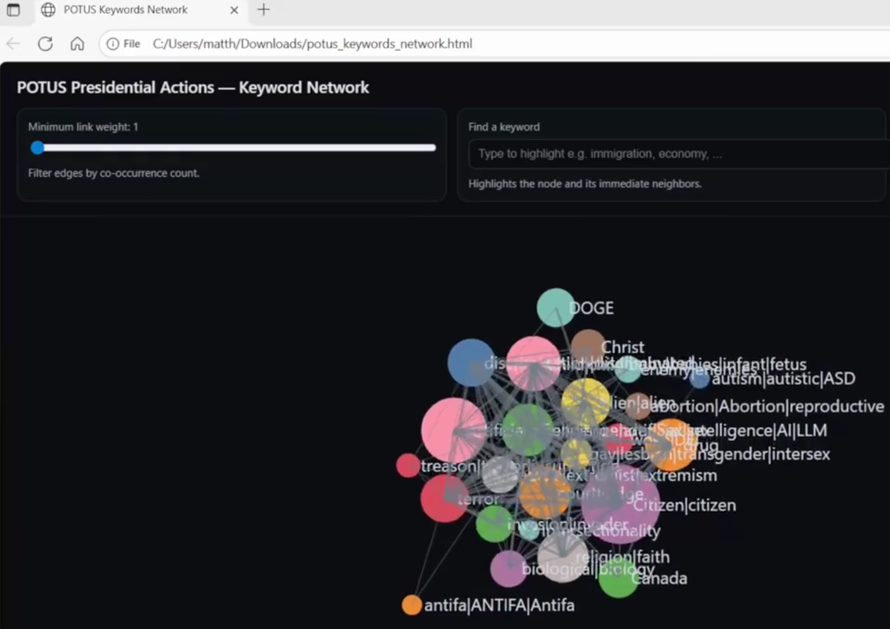

# weird-guys
Textual analyses of U.S. political discourse using NLP, LLM-assisted workflows, and graph visualizations. 

*Work in Progress - Coming Soon*

## About
- Ongoing textual analysis of U.S. political discourse using NLP, LLM-assisted workflows, and graph visualization techniques.
- Exploratory analysis over purely deductive research. I don't know what I'll find until after I've found it!

## Current Focus
- **Presidential Actions Analysis**: Scraping and analyzing White House proclamations, executive orders, and memoranda (Feb 2025-Present)
- **Political Discourse Corpus**: Building a dataset of writings by/about various political figures (2007-Present)

## Planned Analyses
- Keyword trend analysis over time
- Network visualization of term co-occurrence  
- NLP & LLM-assisted theme discovery

***
# Exploratory analyses of POTUS Presidential Actions


I assembled these data to test various hypotheses and assumptions I had about US politics. My intentions are to use **textual analyses, NLP, LLMs and data visualization techniques** to 

1. interrogate the validity of my hypotheses and assumptions
2. discover trends or relationships I did not anticipate

Over time, my methods and visualizations are subject to change, and the dataset is subject to grow, but my first steps were to

*select keywords & themes I believed to be significant*
- Count them
- graph them

## Data Ingestion Process
Over several months, I extracted and categorized ‘Presidential Actions’ from the official Whitehouse website
- Manually selected samples
- Automatically extracted full website text with a Google Apps Script web scraping script.

 ## Initial exploration
I used fragile, shameful, and forbidden techniques to quickly search each article for keywords, and output Boolean TRUE/FALSE values
```
=ARRAYFORMULA(IF(AF2:AF<>"", IF(REGEXMATCH(AF2:AF, G1), TRUE, FALSE), ""))
```
Similar *keywords and synonyms* were included in the Boolean search with pipes, e.g.
- gay|lesbian|transgender|intersex
- radical|extremist|extremism

  ***

## Incorporating LLMs
I used GPT-5 to (1) transform my spreadsheet data into graph data, (2) export these data as a **.GEXF file**. ChatGPT’s first attempt showed promise, but wasn’t particularly noteworthy, useful or legible. 
Techniclly, data was visualised - but no story; a bird's nest full of weird confusing eggs.

## Prompt given to GPT-5:

```
I want to visualize the data in "POTUS Presidential Actions" from the attached Google Sheets document. 
This spreadsheet is a database of articles.

- Columns G:AE tracks keywords, with Boolean values ["TRUE", "FALSE"] denoting if a given row mentions a given keyword. 
- I want an interactive force-directed network graph to visualize the relationship various keywords have.
```



***
# Incorporating Gephi
I am still learning to use and understand Gephi and graph visualizations, but I am already asking unanticipated questions based on stories that emerge from the data. 
- Keyword size denotes frequency within dataset
- Green lines connect words that are found in the same ‘Presidential Action’
- Line thickness denotes frequency that connected words appear together
