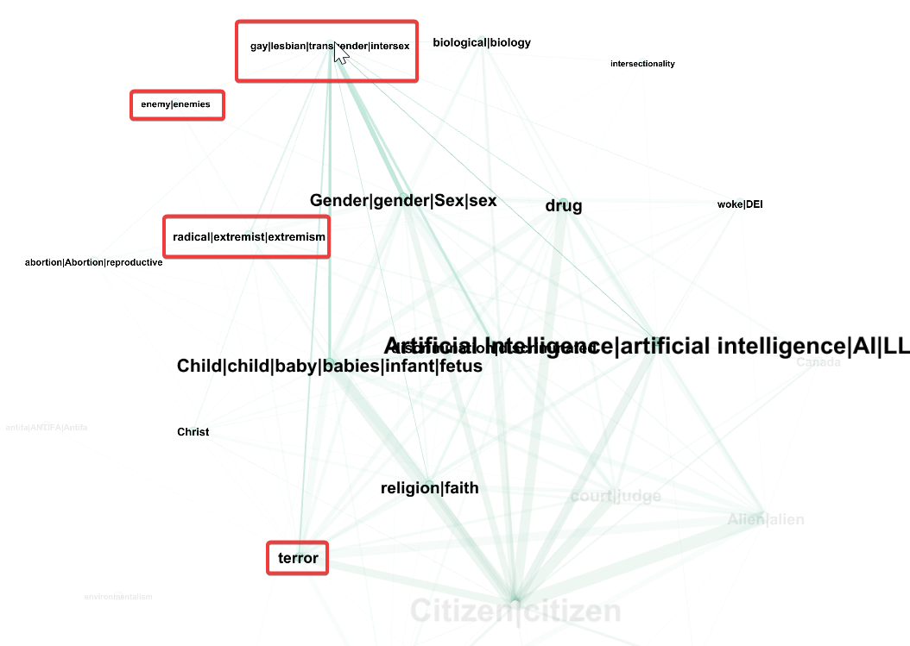

# weird-guys
*Textual analyses of U.S. political discourse using NLP, LLM-assisted workflows, and graph visualizations.*

One of my ongoing hyperfixations of 2025 is exploring trends/people/keywords in US politics. My primary dataset is:

**[POTUS Presidential Actions](https://docs.google.com/spreadsheets/d/1xhZPyUYXrsAF5z6kTfYSFieFw1R6JO1cmkVFakNu-uk/edit?usp=sharing)**
- A representative sample of ‘Presidential Actions’ lifted from [whitehouse.gov](https://www.whitehouse.gov/)
- Sample size **n=176**, (46% of total corpus) was selected to balance analytical depth with processing constraints. Contains "proclamations", "executive orders", & "memoranda" (timeframe ranges from February 2025 - September 2025)
- Web-scraped text of each ‘Presidential Action’
- Some metadata
> **Constraints & limitations** are addressed in more detail within the *Spreadsheet [README](https://docs.google.com/spreadsheets/d/1xhZPyUYXrsAF5z6kTfYSFieFw1R6JO1cmkVFakNu-uk/edit?gid=1190618694#gid=1190618694&range=A1) *.

## About
- Ongoing textual analysis of U.S. political discourse using NLP, LLM-assisted workflows, and graph visualization techniques.
- Exploratory analysis over purely deductive research. I don't know what I'll find until after I've found it!

## Current Focus
- **Presidential Actions Analysis**: Scraping and analyzing White House proclamations, executive orders, and memoranda (Feb 2025-Present)
- ~~**Political Discourse Corpus**: Building a dataset of writings by/about various political figures (2007-Present)~~

## Planned Analyses
- Keyword trend analysis over time
- Network visualization of term co-occurrence  
- NLP & LLM-assisted theme discovery

***
# Exploratory analyses of POTUS Presidential Actions
I assembled these data to test various hypotheses and assumptions I had about US politics. My intentions are to use **quantitative textual analyses, NLP, LLMs & data visualization techniques** to 
1. interrogate the validity of my hypotheses and assumptions
2. discover trends or relationships I did not anticipate

> # Hypotheses
> > **While I begin with these specific hypotheses, the *Weird Guys Project* remains fundamentally exploratory. I am interested in discovering unexpected patterns and relationships that challenge my initial assumptions.**
> > - The keywords analyzed in this initial exploration were manually selected based on my my domain knowledge and research hypotheses. *This approach risks confirmation bias and may miss significant themes* outside my predetermined focus.
> > - To reduce selection bias and draw stronger conclusions, future iterations should utilize automated NLP techniques, topic modeling, or clustering algorithms to identify statistically significant keyword patterns without prior assumptions.
> > - Dataset only includes a sample of the **DJT's second term as POTUS, 2025**. It may be have been useful to compare with (a) their previous term, and (b) other Presidents.
>
> 
> ## My hypotheses:
> 1. **Linguistic Framing of Social Groups:** The language used in Presidential Actions will show distinct, measurable patterns when discussing topics related to **reproductive rights, gender-nonconforming individuals**, and **immigration**. I hypothesize this language may align with frameworks of restriction or opposition more frequently than with frameworks of support or inclusion.
> 2. **Strategic Focus on the Judiciary:** There will be a significant emphasis on the **judicial branch** (e.g., frequent mentions of judges, courts, rulings). I hypothesize that this is a strategic channel through which policy preferences on the issues above are articulated or anticipated.
> 3. **Networked Keyword Relationships:** I expect to see a strong co-occurrence network between **judicial keywords** and keywords related to **reproductive rights, gender identity, and immigration.** This would visually illustrate the hypothesized strategic link between the judiciary and these policy areas.

Over time, my methods and visualizations are subject to change, and the dataset is subject to grow, but my first steps were to
1. [Count](https://docs.google.com/spreadsheets/d/1xhZPyUYXrsAF5z6kTfYSFieFw1R6JO1cmkVFakNu-uk/edit?gid=95626583#gid=95626583&range=A1) words
2. [graph](https://lookerstudio.google.com/s/ngv-FD0AbXM) words
3. select keywords & themes I believed to be significant

Nothing particularly interesting...


## Data Ingestion Process
Over several months, I extracted and categorized ‘Presidential Actions’ from the official Whitehouse website
- Manually selected samples
- Automatically extracted full website text with a [Google Apps Script (GAS) web scraping script](apps-script/full_text.js).

<details>
  <summary>Click for summary of the Apps Script functions...</summary>
  <p><b> GAS web scraping functions:</b></p>
<ul>
  <li>Get the active spreadsheet’s <em>active sheet</em> for data and the <em>logs</em> sheet for logging.</li>
  <li>Read the header row (row 1) to find the column indexes for <code>url</code>, <code>full_text</code>, and <code>char_count</code>.</li>
  <li>If any of those headers are missing, create them in row 1 (so each column exists).</li>
  <li>Determine the last data row, then read all URLs (from the <code>url</code> column) and any existing text (from the <code>full_text</code> column) starting at row 2.</li>
  <li>For each row:
    <ul>
      <li>If the URL cell is empty, skip the row.</li>
      <li>If <code>full_text</code> already has content, skip and add a “Skipped (Already processed)” log entry.</li>
      <li>Otherwise:
        <ul>
          <li>Fetch the page HTML at the URL (HTTP errors won’t throw due to <code>muteHttpExceptions: true</code>).</li>
          <li>Clean the HTML by removing <code>&lt;script&gt;</code> and <code>&lt;style&gt;</code> blocks, stripping all tags, and collapsing whitespace.</li>
          <li>Truncate the cleaned text to 50,000 characters and compute its length.</li>
          <li>Write the truncated text to the row’s <code>full_text</code> cell and the length to <code>char_count</code>.</li>
          <li>Queue a log entry noting the row number and character count.</li>
        </ul>
      </li>
      <li>If any error occurs during fetch/processing, queue a log entry with the error message and row number.</li>
    </ul>
  </li>
  <li>After processing all rows, append all queued log entries (timestamp + message) to the <em>logs</em> sheet.</li>
</ul>

</details>

 ## Initial exploration
 <a href="https://docs.google.com/spreadsheets/d/1xhZPyUYXrsAF5z6kTfYSFieFw1R6JO1cmkVFakNu-uk/edit?usp=sharing" target="_blank" title="Click to explore POTUS Presidential Actions">

</a>

 I used fragile, shameful, and forbidden techniques to quickly search each article for keywords, and output Boolean TRUE/FALSE values. 
```
=ARRAYFORMULA(IF(AF2:AF<>"", IF(REGEXMATCH(AF2:AF, G1), TRUE, FALSE), ""))
```
Similar *keywords and synonyms* were included in the Boolean search with pipes, e.g.
- gay|lesbian|transgender|intersex
- radical|extremist|extremism

  ***

## Incorporating LLMs
I used GPT-5 to (1) transform my spreadsheet data into graph data, (2) export these data as a **.GEXF file**. ChatGPT’s first attempt showed promise, but wasn’t particularly noteworthy, useful or legible. 
Techniclly, data was visualised - but no story; a bird's nest full of weird confusing eggs.

## Prompt given to GPT-5:

```
I want to visualize the data in "POTUS Presidential Actions" from the attached Google Sheets document. 
This spreadsheet is a database of articles.

- Columns G:AE tracks keywords, with Boolean values ["TRUE", "FALSE"] denoting if a given row mentions a given keyword. 
- I want an interactive force-directed network graph to visualize the relationship various keywords have.
```


***
# Incorporating Gephi
Happy that GPT-5 could structure CSV files as graph data, I asked it to export the data as a **.GEXF** file.

> ## Key Data Components
> A GEXF file primarily stores the components of a graph or network:
> - **Nodes (Vertices):** The individual entities within the network (e.g., people, websites, genes).
> - **Edges (Links):** The connections between the nodes, representing relationships (e.g., friendships, hyperlinks, interactions). Edges can be **directed** (A links to B) or **undirected** (A and B are related).

I am still learning to use and understand Gephi and graph visualizations, but I am already asking unanticipated questions based on stories that emerge from the data. 
- Keyword size denotes frequency within dataset
- Green lines connect words that are found in the same ‘Presidential Action’
- Line thickness denotes frequency that connected words appear together

  
  > My first visualization gives me hope that my methodology is plausibly capturing encoded meaning. It appears to show patterns predicted in the hypothesis
  > - 

***
# CLIFFHANGER: An Unexpected Finding?

During network analysis, one visualization revealed 2 curious patterns I did not anticipate:

> ## POTUS's rhetoric implies LGBTQ keyword clusters have some unsavoury neighbours
> [](https://youtu.be/JJyQC4RQgHI)


## **Artificial Intelligence** keyword clusters appear to show high centrality
- The strength of these connections is visually prominent despite not being part of my original hypotheses


## **Open Questions:**
- Are these patterns statistically significant, or an artifact of my methodology?
- Does it represent a meaningful relationship in the data, or random clustering?
- If valid, what might this reveal about unexamined aspects of political discourse?

**Why I'm Not Investigating Yet:**
- This exploration remains focused on testing my initial hypotheses, and refining my workflows & toolkits.
- Proper investigation would require new methodological approaches - which I am still refining
- I want to avoid premature interpretation without rigorous validation


<details>
  <summary>One final note (Click to Expand) 👇</summary>

  - I didn't include every step or code snippet for the ChatGPT-generated. 
  - That would have been the coding equivalent of watching a cooking show where a guy orders a Pizza on Uber Eats, sends it back 5 times for being wrong, and gets in 3 arguments with the delivery driver who suddenly insists "customers *always* go to the store to make their own pizza.
  - If that happens on cooking shows, we'd never know, because they too would just leave that ordeal on the cutting room floor and jumpcut straight to the cheese-pull.
</details>

